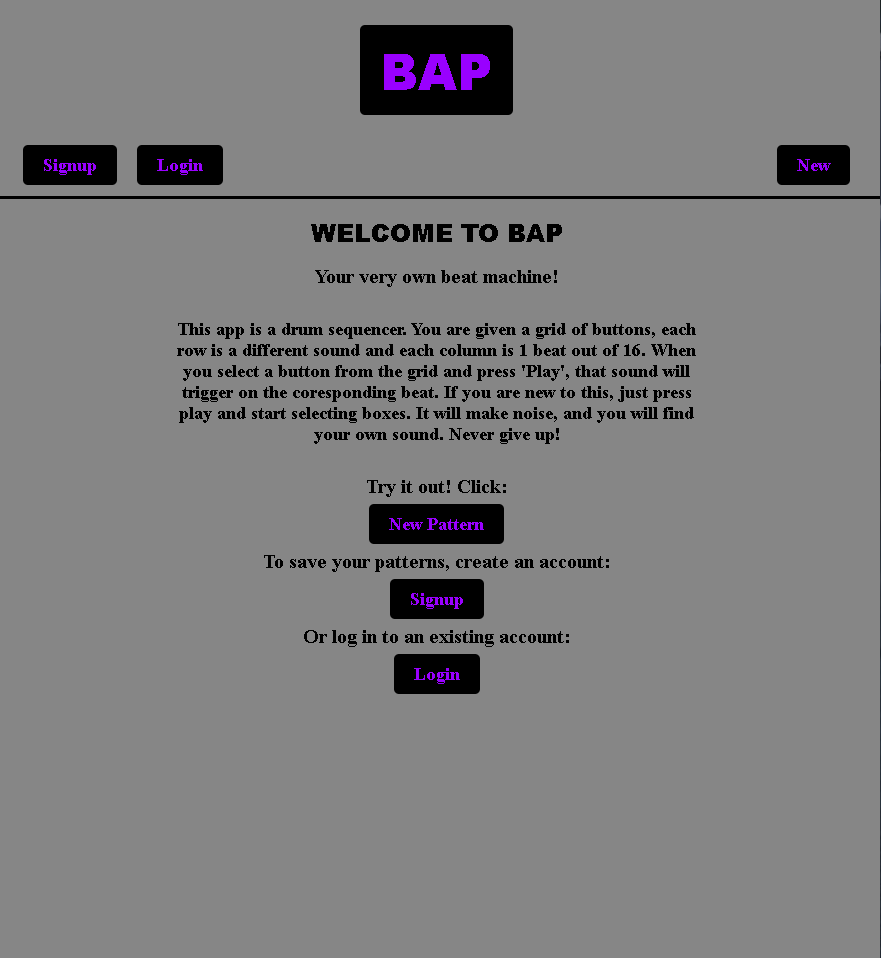
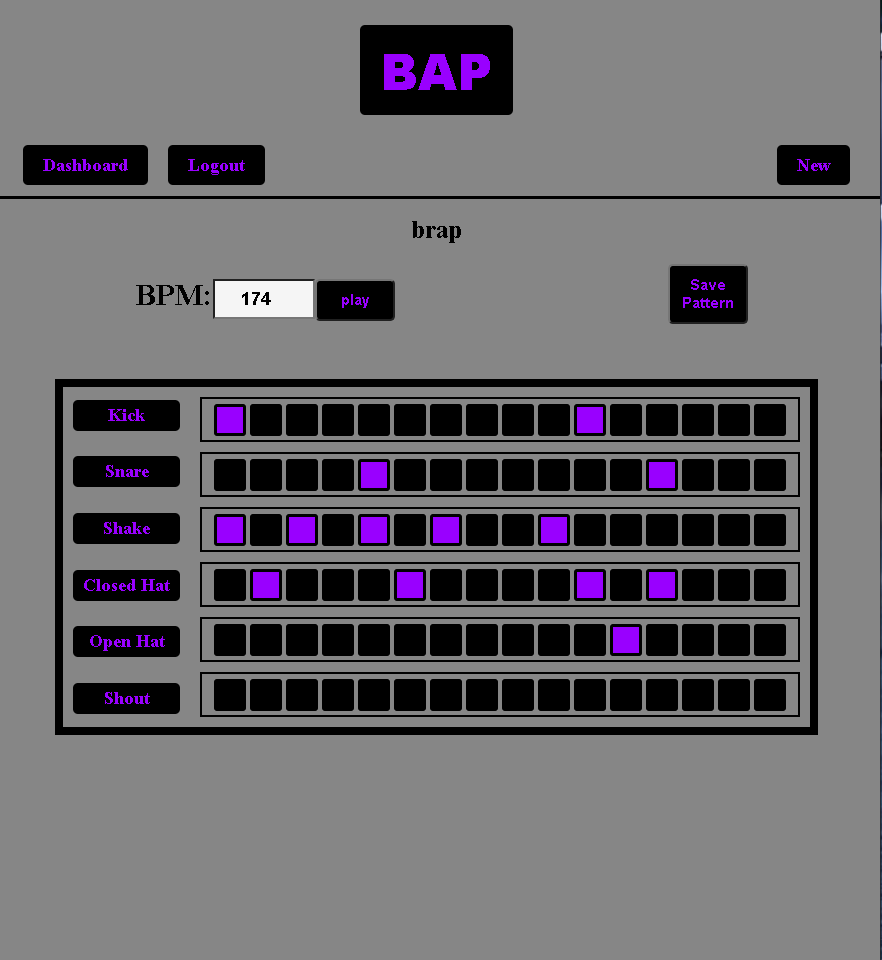

# BAP

[Live app]https://bap-capstone1-bradfordbosen.vercel.app/
[Client repository]https://github.com/BandoCoder/bap-capstone1-bradfordbossen
[API documentation]https://github.com/BandoCoder/bap-server-bradfordbossen/blob/main/README.md
[API repository]https://github.com/BandoCoder/bap-server-bradfordbossen

## Screenshots

## Description

BAP is a web based drum sequencer, used for making and saving beats. Feel free to visit the live app by clicking the link at the top. Or you can follow the instructions to open it up on your own machine and add whatever insturments you like.

## Instructions

Clone the repo
run 'npm i' to install dependencies
run 'npm start'

## Technical

#### Front

Tone.js interfaces with the Web Audio Api.
(Documentation here: https://tonejs.github.io/)
React.js
CSS

#### Back

Node.js, Postgres, REST, Express
